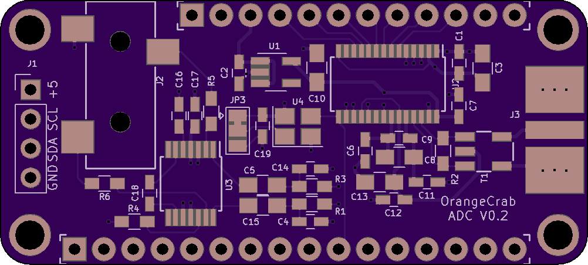
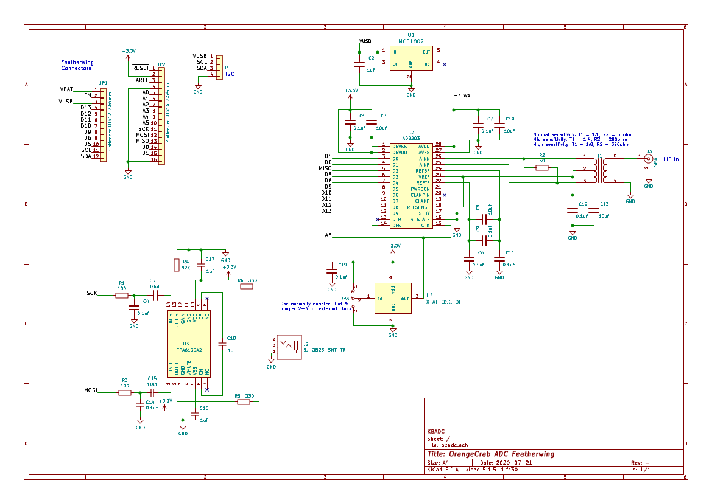
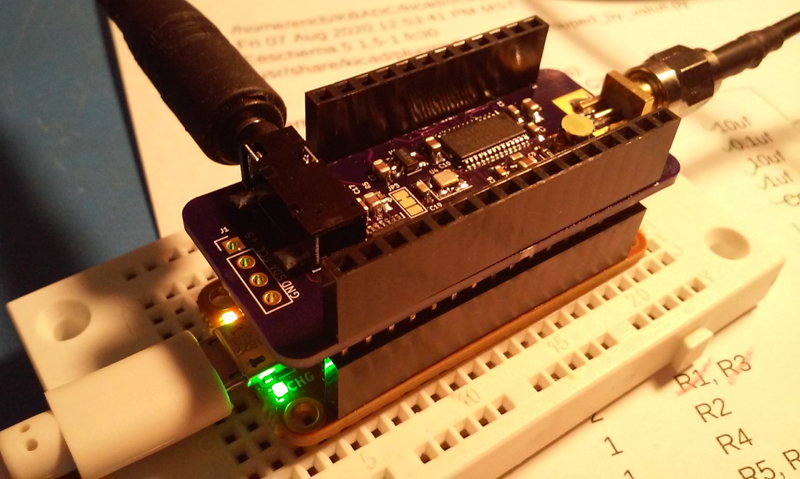

# orangecrab_adc
An ADC and audio FeatherWing to enable SDR experiments with the OrangeCrab

## What is it?
This is an experiment to see if a low-spec SDR system can be easily built
using the OrangeCrab FPGA Feather. It will consist of the ADC / Audio 
"FeatherWing" board which attaches to the OrangeCrab board, along with
gateware to do basic tuning and demodulation. Initial testing will be
static setups, or controlled by USB, but the project may be expanded with
a UI board containing display and buttons / encoders.

## Features
The board comprises the following components:

* AD9203 10-bit / 40MSPS parallel ADC
* 40MHz crystal oscillator
* Analog supply regulation
* 50-ohm SMA input with transformer-coupling to the converter
* TPA6139 Headphone amplifier and 3.5mm jack
* 4-pin I2C bus extension (power, clock, data, gnd)

## Schematic

## Status
* 2020-07-24: The preliminary board design is complete and boards have been
ordered from OSHPark. Parts have been ordered so initial testing should occurr
sometime in early August 2020.

* 2020-08-08: Boards are back from OSHpark and the preliminary test gateware
is working for simple AM broadcast reception. Audio output sounds great -
very clean and clear. 

* 2020-08-09: Corrected missing mount holes in PCB. Updated OSHpark link

https://oshpark.com/shared_projects/GzvQCkin

* 2020-08-18: Added Litex-based controller project

https://github.com/emeb/OrangeCrab-Litex-ADC
